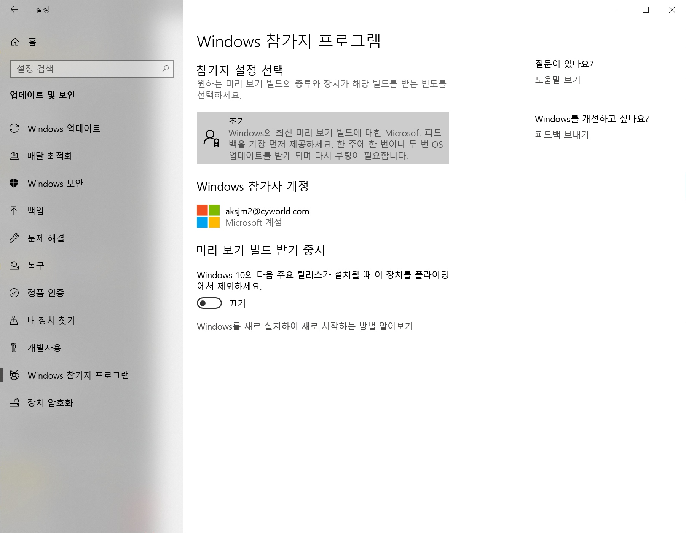

# WSL2 적용하기

#### Windows 참가자 프로그램 신청



* 신청 후 Windows 업데이트에 확인하면 평가판 release를 업데이트 받을 수 있다.

#### Windows 추가기능 활성화

```text
PS C:\WINDOWS\system32> Enable-WindowsOptionalFeature -Online -FeatureName VirtualMachinePlatform 
```

Powershell 을 관리자 권한으로 실행하여 위 명령어를 수행한다.

#### Ubuntu 18.04 LTS 설치

Microsoft Store 에서 Ubuntu 를 검색하여 다운받는다.


#### WSL 설치

```text
Enable-WindowsOptionalFeature -Online -FeatureName Microsoft-Windows-Subsystem-Linux
```

Powershell 관리자권한으로 실행하여 위 명령어를 수행한다.

시스템 재시작이 필요하다.

앞서 설치한 Ubuntu 18.04 LTS 를 실행한다.

> Linux 배포버전 설치가 진행된다.
>
> 계정을 설정한 뒤 빠져나온다.

```text
PS C:\WINDOWS\system32> wsl -l
Linux 배포용 Windows 하위 시스템:
Ubuntu-18.04(기본값)
```

위 명령어를 powershell에서 수행하여 설치된 시스템을 확인한다.

```text
wsl --set-version Ubuntu-18.04 2
```

위 명령어를 통해 WSL2 버전을 활성화 한다.


